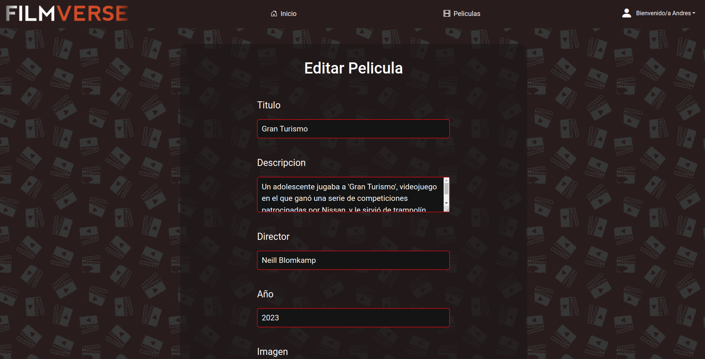

# Proyecto Integrado Desarrollo de Aplicaciones Web

#### Curso 23/24

#### Andrés Segura Sáez

## FilmVerse

FilmVerse es una plataforma de transmisión de películas en streaming que ofrece acceso gratuito a los usuarios que se registren en el sistema.

Mi web está diseñada de la siguiente manera:

**Tipos de Usuarios**
- **Usuario:** puede ver el catálogo de películas, accede a ellas y puede editar su perfil.

- **Administrador:** puede ver el catálogo de películas, puede añadir, editar y eliminar una película. Editar su perfil, tambien puede ver y borrar todos los usuarios registrados en el sistema.

**Enlace a la aplicación**

    La aplicación está diseñada para que el usuario tenga que registrarse
    o iniciar sesión para acceder, a continuación voy a indicar un usuario de cada tipo:

    - Usuario:
        Email: faku@email.com
        Contraseña: 123456

    - Administrador:
        Email: andres@email.com
        Contraseña: 123456

**Páginas y Funcionalidades**

- **Dashboard:** El usuario puede registrarse o iniciar sesión en el sistema.

- **Registro:** El usuario debe completar sus datos para registrarse satisfactoriamente.

- **Inicio sesión:** El usuario debe introducir sus datos para acceder al sistema.

- **Home:** página principal que al loguearte identifica al usuario, desde aquí también se puede cerrar sesión y acceder al perfil. Contiene un carousel y una sección de películas recomendadas para el usuario.

- **Catálogo:** página donde se albergan todas las películas del sistema con un filtro por categoría.

- **Catálogo (Admin):** página donde se albergan todas las películas del sistema con un filtro por categoría y desde la cual el admin tendrá un botón para añadir películas.
 

- **Añadir Película (Admin):** página a la que llegas desde el botón *Añadir Película*.

- **Detalle Película:** el usuario podrá leer la sinopsis de la película y ver detalles como director, año, categoría, etc. Abajo cuenta con un botón que redirige a la visualización de la película.

- **Detalle Película (Admin):** en esta pantalla el admin cuenta con 3 botones: uno para ver la película, otro para editar y otro para eliminar (desde aquí se elimina directamente a través de confirmación).

- **Editar Película (Admin):** en esta página el admin puede editar los datos de la película seleccionada.

- **Visualización:** en esta pantalla el usuario podrá ver la película.

- **Perfil:** en esta pantalla el usuario podrá modificar sus datos y darse de baja en el sistema.

- **Perfil (Admin):** en esta pantalla el usuario podrá modificar sus datos y darse de baja. Aparte podrá visualizar y eliminar los usuarios registrados en el sistema.
